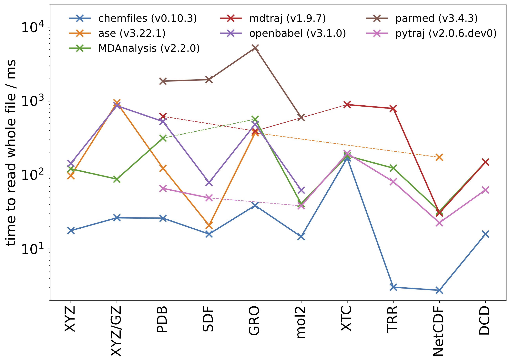

# Chemistry file readers benchmarks

This repository contains benchmarks comparing the performance of different
libraries when reading various file formats used in theoretical and
computational chemistry and biology. The benchmarks only test opening a file and
reading it in full, not running analysis on the resulting trajectory.

Libraries compared:

- [chemfiles](https://chemfiles.org)
- [MDAnalysis](https://mdanalysis.org)
- [OpenBabel](http://openbabel.org/)
- [ASE](https://wiki.fysik.dtu.dk/ase/)

## Running the benchmarks on your system

```bash
git clone https://github.com/chemfiles/benchmarks
cd benchmarks
./install-benchmarks.sh
./run-benchmarks.sh
```

## Caveats

Different libraries are able to read different formats, and can sometimes do
more work when opening and reading files.

We benchmark the code running from Python, even if some libraries have other
languages interfaces.

We use the version of each software as provided in conda, without special tuning
for a given system.

When in doubt, run benchmark using with your own code and use cases!

## Results

In most of the tested cases, chemfiles is faster than other softwares.
Exceptions to this seems to be the XTC and DCD readers in MDAnalysis, when
running on macOS.

Each library is tested with multiple format (text formats, direct reading of
compressed text, and binary formats). For each library, the time required to
open and read the full trajectory is reported; as well as the timing ratio with
respect to chemfiles (higher is slower).

This graph shows the results on Linux:


### macOS 12.4, SSD APFS, M1 Max CPU

All timings are in milliseconds.

| file               | chemfiles (v0.10.3) | ase (v3.22.1)      | MDAnalysis (v2.2.0) | mdtraj (v1.9.7)     | openbabel (v3.1.0) | parmed (v3.4.3)      | pytraj (v2.0.6)    |
|--------------------|---------------------|--------------------|---------------------|---------------------|--------------------|----------------------|--------------------|
| water.xyz          | 4.87                | 46.00 - **9.5x**   | 18.52 - **3.8x**    |                     | 44.57 - **9.2x**   |                      |                    |
| water.xyz.gz       | 12.75               | 505.79 - **39.7x** | 25.41 - **2.0x**    |                     | 411.59 - **32.3x** |                      |                    |
| 1vln-triclinic.pdb | 11.47               | 66.54 - **5.8x**   | 102.12 - **8.9x**   | 334.51 - **29.2x**  | 302.76 - **26.4x** | 984.93 - **85.9x**   | 20.38 - **1.8x**   |
| lmsd.sdf           | 5.19                | 8.62 - **1.7x**    |                     |                     | 41.62 - **8.0x**   | 984.03 - **189.4x**  | 7.04 - **1.4x**    |
| vesicles.gro       | 12.91               | 181.34 - **14.0x** | 311.04 - **24.1x**  | 215.69 - **16.7x**  | 146.50 - **11.4x** | 2707.65 - **209.7x** |                    |
| molecules.mol2     | 5.18                |                    | 15.72 - **3.0x**    |                     | 29.02 - **5.6x**   | 325.65 - **62.8x**   | 11.08 - **2.1x**   |
| ubiquitin.xtc      | 79.41               |                    | 58.10 - 0.73x       | 473.29 - **6.0x**   |                    |                      | 69.61 - 0.88x      |
| ubiquitin.trr      | 1.19                |                    | 24.43 - **20.5x**   | 432.94 - **363x**   |                    |                      | 18.85 - **15.8x**  |
| water.nc           | 0.92                | 36.44 - **39.4x**  | 2.02 - **2.2x**     | 4.21 - **4.55x**    |                    |                      | 7.16 - **7.8x**    |
| adk.dcd            | 7.18                |                    | 5.39 - 0.75x        | 85.56 - **11.9x**   |                    |                      | 12.74 - **1.8x**   |

### Ubuntu Linux 20.04, SSD ext4, Intel Xeon 4214R CPU

All timings are in milliseconds.

| file               | chemfiles (v0.10.3) | ase (v3.22.1)      | MDAnalysis (v2.2.0)| mdtraj (v1.9.7)     | openbabel (v3.1.0) | parmed (v3.4.3)      | pytraj (v2.0.6)     |
|--------------------|---------------------|--------------------|--------------------|---------------------|--------------------|----------------------|---------------------|
| water.xyz          | 17.72               | 97.73 - **5.5x**   | 121.17 - **6.8x**  |                     | 143.75 - **8.1x**  |                      |                     |
| water.xyz.gz       | 26.41               | 948.20 - **35.9x** | 88.07 - **3.3x**   |                     | 865.02 - **32.8x** |                      |                     |
| 1vln-triclinic.pdb | 26.09               | 123.60 - **4.7x**  | 315.89 - **12.1x** | 620.56 - **23.8x**  | 529.36 - **20.3x** | 1860.58 - **71.3x**  | 65.92 - **2.5x**    |
| lmsd.sdf           | 15.92               | 20.88 - **1.3x**   |                    |                     | 79.10 - **5.0x**   | 1952.52 - **122.7x** | 49.05 - **3.1x**    |
| vesicles.gro       | 38.72               | 371.38 - **9.6x**  | 568.72 - **14.7x** | 393.73 - **10.2x**  | 485.10 - **12.5x** | 5229.44 - **135.1x** |                     |
| molecules.mol2     | 14.66               |                    | 40.90 - **2.8x**   |                     | 62.50 - **4.3x**   | 602.32 - **41.1x**   | 38.32 - **2.6x**    |
| ubiquitin.xtc      | 169.95              |                    | 181.97 - **1.0x**  | 895.10 - **5.3x**   |                    |                      | 195.14 - **1.2x**   |
| ubiquitin.trr      | 3.04                |                    | 123.98 - **40.8x** | 793.42 - **261.0x** |                    |                      | 81.19 - **26.7x**   |
| water.nc           | 2.76                | 173.51 - **62.8x** | 32.44 - **11.8x**  | 30.65 - **11.1x**   |                    |                      | 22.63 - **8.2x**    |
| adk.dcd            | 15.87               |                    | 149.44 - **9.4x**  | 149.02 - **9.4x**   |                    |                      | 62.90 - **4.0x**    |

## Contributions

Improvements to the benchmarks and more files to be tested are very welcome!
